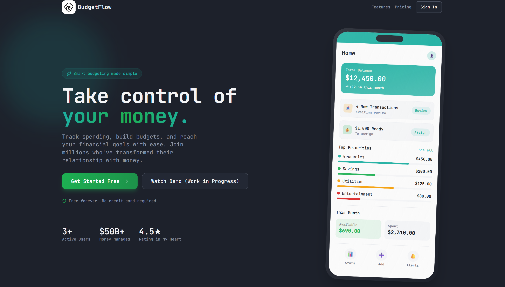

  

<h1 align="center">BudgetFlow</h1>

  <b>Personal Finance Management Platform</b> 
  Built with modern web technologies and AI-powered insights.

  <a href="#about-the-project"><b>About The Project</b></a>
  &nbsp;·&nbsp;
  <a href="#how-it-works"><b>How It Works</b></a>
  &nbsp;·&nbsp;
  <a href="#tech-stack"><b>Tech Stack</b></a>
  &nbsp;·&nbsp;
  <a href="#key-features"><b>Features</b></a>

  
  
  
  

---

## About The Project

BudgetFlow is a comprehensive personal finance management platform that helps users track their spending, manage budgets, and gain intelligent insights into their financial habits. With AI-powered analytics and intuitive design, BudgetFlow makes financial planning accessible and actionable.

## How It Works

1. **Sign Up & Set Goals**: Create your account and establish your financial goals and budget categories
2. **Track Transactions**: Add income and expenses with automatic categorization
3. **Monitor Budgets**: View real-time budget progress with visual indicators and alerts
4. **Get AI Insights**: Receive personalized recommendations based on your spending patterns
5. **Analyze Reports**: Access detailed analytics and reports to understand your financial health
6. **Optimize Spending**: Use insights to make informed decisions and improve your financial habits

## Tech Stack

**Frontend:**
- React with TypeScript
- Vite for fast development and building
- Tailwind CSS for responsive styling
- shadcn/ui for modern UI components
- Chart.js for data visualization
- React Query for efficient data fetching
- React Router for navigation

**Backend:**
- Express.js server with TypeScript
- Supabase for database and authentication
- OpenAI integration for AI-powered insights
- RESTful API design
- Rate limiting and security middleware
- Docker containerization

**Database & Services:**
- Supabase PostgreSQL database
- OpenAI API for intelligent insights
- Secure authentication and authorization
- Real-time data synchronization

## Key Features

- ** Budget Management**: Create, edit, and track budgets across multiple categories
- ** Transaction Tracking**: Add and categorize income and expenses with ease
- ** Visual Analytics**: Interactive charts and progress bars for budget visualization
- ** AI Insights**: Personalized spending analysis and recommendations
- ** Responsive Design**: Seamless experience across desktop and mobile devices
- ** Secure Authentication**: Supabase-powered user management and data security
- ** Comprehensive Reports**: Detailed financial reports and trend analysis
- ** Real-time Updates**: Live budget tracking and instant data synchronization
- ** Modern UI**: Clean, intuitive interface built with shadcn/ui components
- ** Smart Alerts**: Budget limit notifications and spending insights

