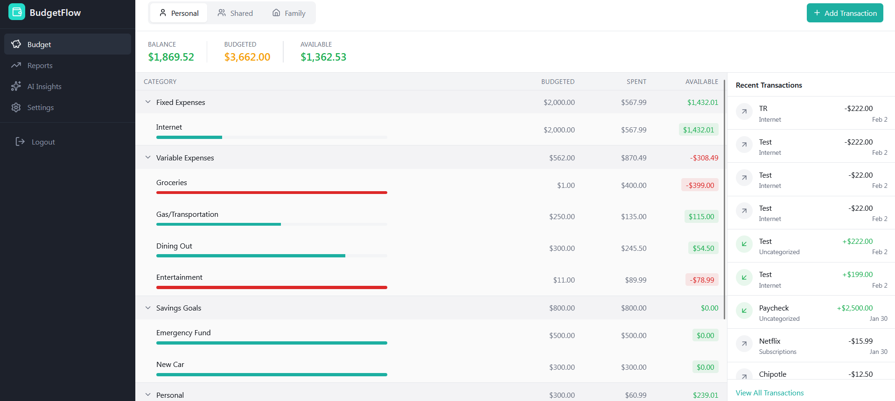
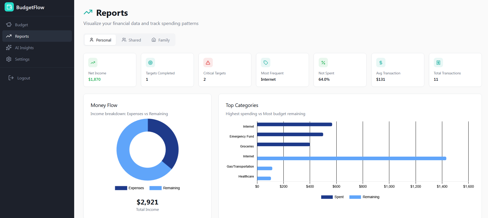

<h1 align="center">BudgetFlow</h1>

  <b>Personal Finance Management Platform</b> 
  Built with modern web technologies and AI-powered insights.

  <a href="#about-the-project"><b>About The Project</b></a>
  &nbsp;·&nbsp;
  <a href="#how-it-works"><b>How It Works</b></a>

  
  
  
  

---

## About The Project, Why BudgetFlow?

BudgetFlow is a comprehensive personal finance management platform that helps users track their spending, manage budgets, and gain intelligent insights into their financial habits. With AI-powered analytics and intuitive design, BudgetFlow makes financial planning accessible and actionable. I made BudgetFlow because I found all the financial trackers online to be either too complicated, requiring multiple step processes to set budget goals, or was simply too overwhelming for users to navigate around. BudgetFlow's core is being light weight and used for quick and easy budgeting.

## How It Works

1. **Sign Up & Set Goals**: Create your account and establish your financial goals and budget categories
2. **Track Transactions**: Add income and expenses with automatic categorization
3. **Monitor Budgets**: View real-time budget progress with visual indicators and alerts
4. **Get AI Insights**: Receive personalized recommendations based on your spending patterns
5. **Analyze Reports**: Access detailed analytics and reports to understand your financial health
6. **Optimize Spending**: Use insights to make informed decisions and improve your financial habits

## Demo

  

## 

- User can add transactions, one being **Income**, other being **Expense**
- User sets **Budget Targets** on each expense category and the application ensures you are not exceeding budget
- **Expense Categories** can be edited and modified as the user likes
- **Budget Targets** can be deleted, with the addition of all past associative transactions being deleted too
- **Interactive Status Bar** represents how close you are to exceeding your budget, with remaining budget shown in **Available** column

## Demo Cont.

  

##
- Displays all of user's **spending habits and areas of expense** that require attention
- Ensures that user has a clear understanding of how much they are actually **saving vs. spending**
- **Clean, lightweight user interface**, ensuring that information is not overwhelming for user experience
